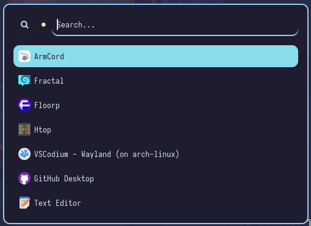
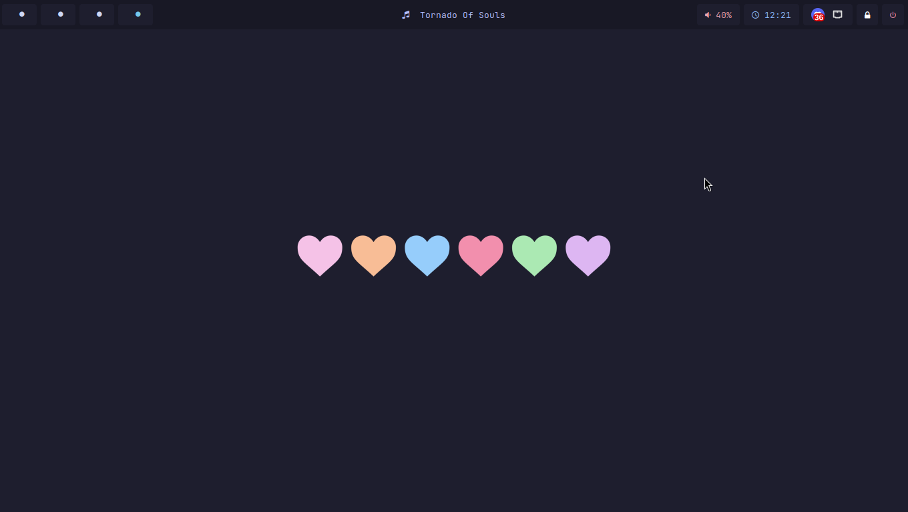
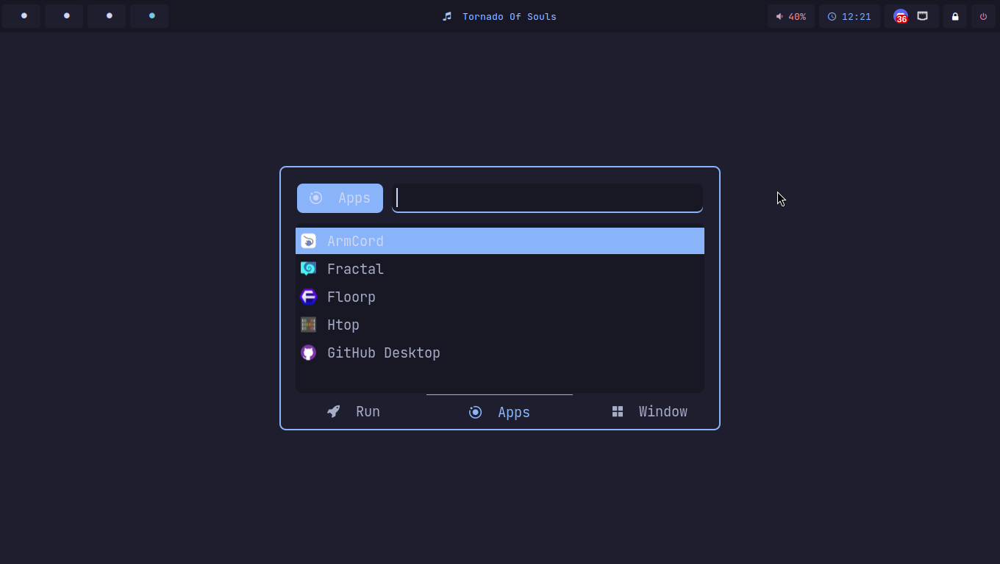
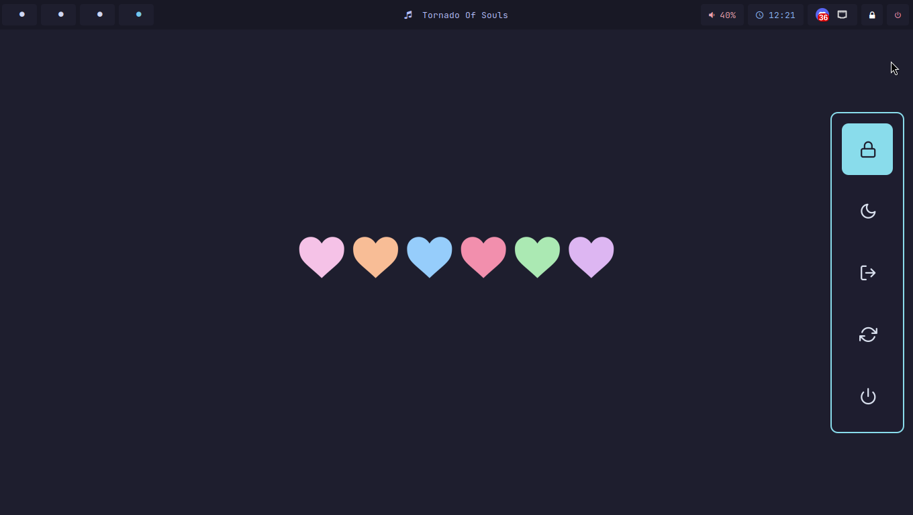
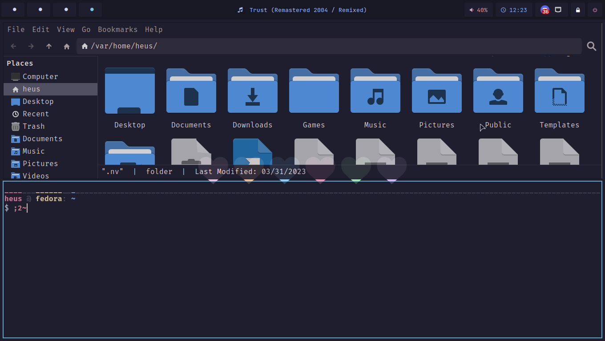
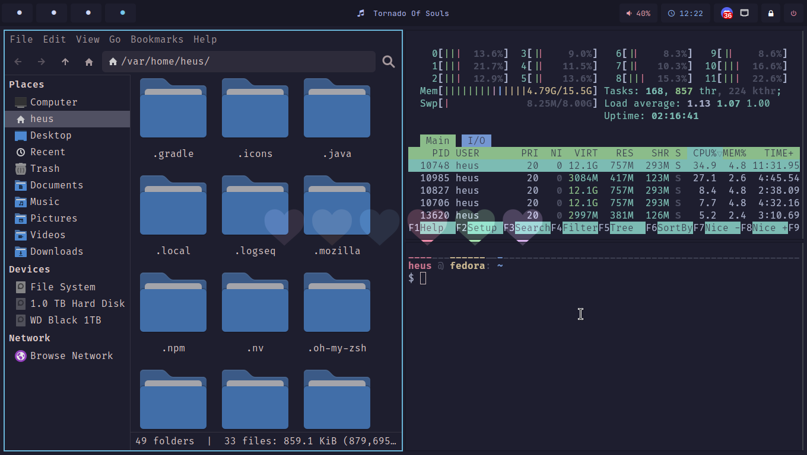
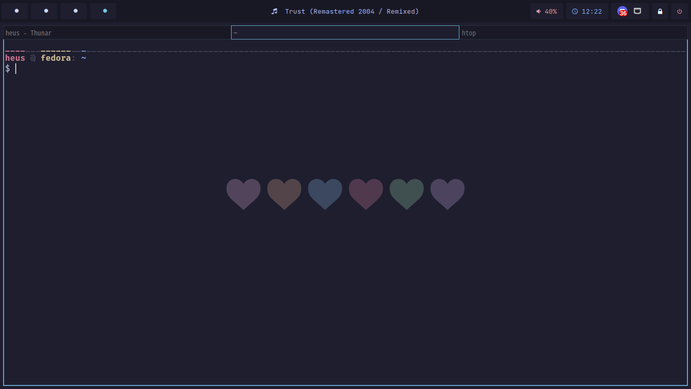
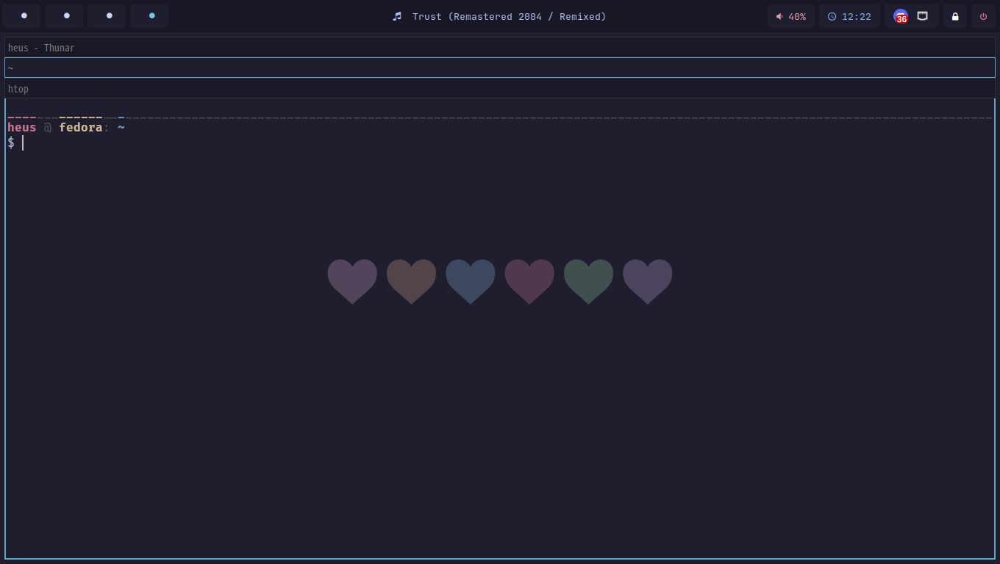

# sway-dotfiles
My Sway dotfiles

## The following things are necessary:
- [Catppuccin GTK](https://github.com/catppuccin/gtk)
- [Catppuccin Cursors](https://github.com/catppuccin/cursors)
- [Papirus Icons](https://github.com/PapirusDevelopmentTeam/papirus-icon-theme)
- [JetBrains Mono](https://github.com/ryanoasis/nerd-fonts/releases/download/v3.1.1/JetBrainsMono.zip)

## Dotfiles are available for the following:
- Sway 
- Waybar 
- Rofi
- Dunst 
- SwayLock 
- Kitty
- Foot
- ZSH
- Kvantum 

## Screenshots

<b>Waybar</b>

<b>Rofi</b>

<b>Full Desktop</b>

