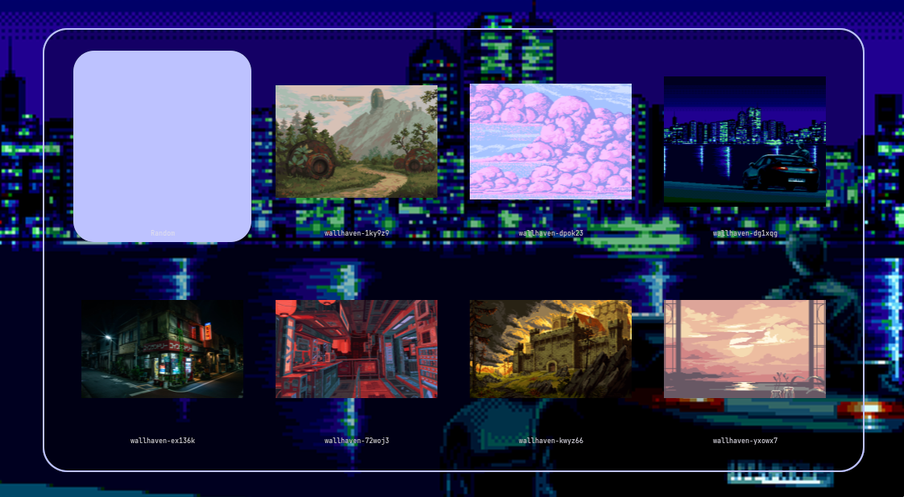
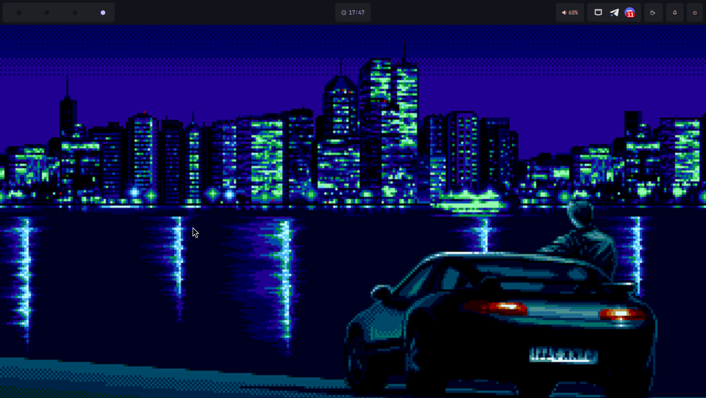
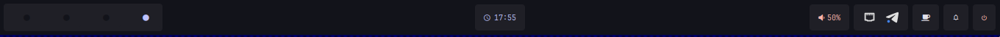
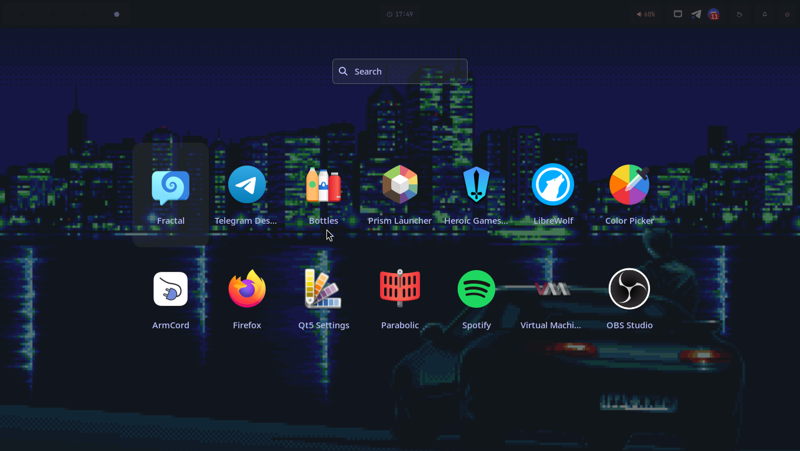
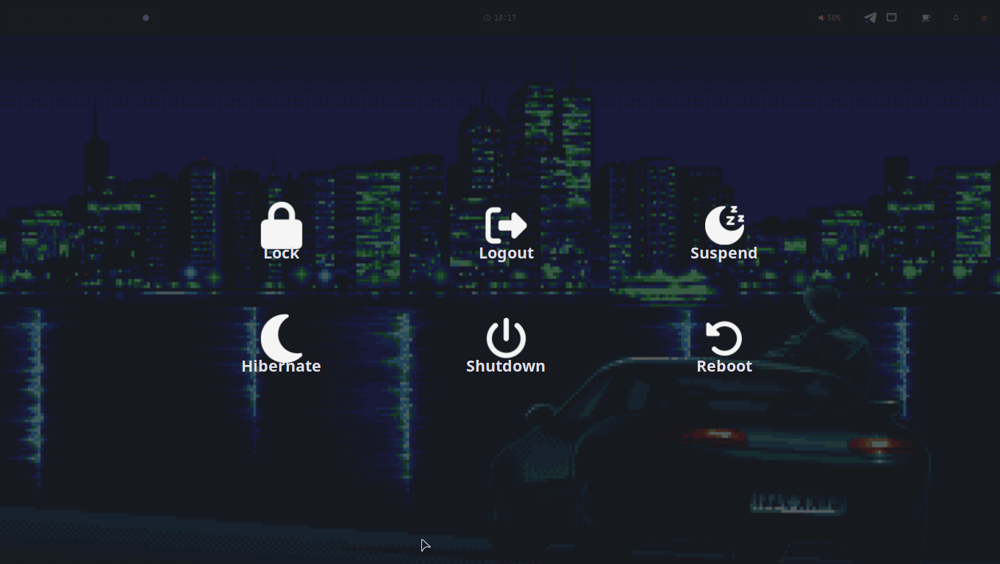
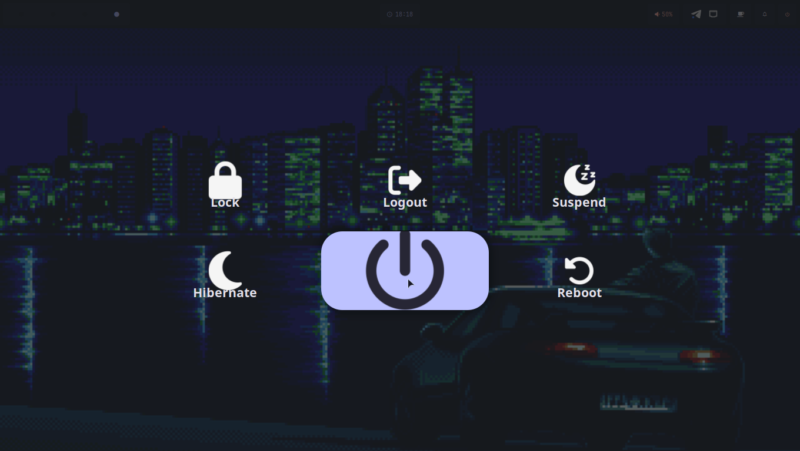

# sway-dotfiles

I tried my best to organize and modularize this sway setup, without making it so rigid that it would be impossible for other people to use it as a reference and just change a few things. Enjoy and customize it to your personal taste.

To use the wallpaper selector, you need to place your wallpapers in the directory `~/Pictures/Wallpapers` (folders with images is ok too). Once you have your images in the correct folder, you can access the wallpaper selector by pressing `Super + T`. This will open the Rofi menu, allowing you to choose from your available wallpapers or select a random one to set as your background.

## The following things are necessary:
- [adw-gtk3](https://github.com/lassekongo83/adw-gtk3)
- [matugen](https://github.com/InioX/matugen)
- [Papirus Icons](https://github.com/PapirusDevelopmentTeam/papirus-icon-theme)
- [JetBrains Mono](https://www.nerdfonts.com/font-downloads)

## Dotfiles are available for the following:
- Sway 
- Waybar 
- Way-shell
- Rofi
- Dunst 
- SwayLock 
- Wlogout
- Kitty
- ZSH

## Screenshots

<b>Full View</b>

<b>Waybar</b>

<b>Rofi</b>

<b>Wlogout</b>

